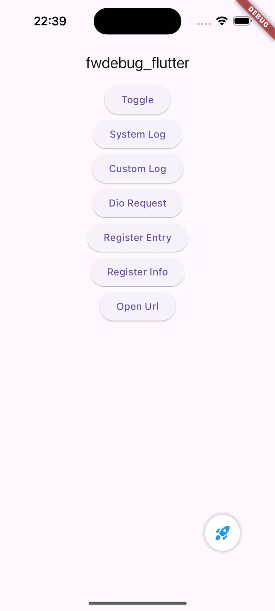

# fwdebug_flutter

Flutter debugging libraray, wrapper for [talker_flutter](https://pub.dev/packages/talker_flutter), [inspector](https://pub.dev/packages/inspector), [FWDebug](https://github.com/lszzy/FWDebug) and so on, to facilitate development and testing.

## Screenshot

## Getting Started
By default, fwdebug_flutter is available in all modes. If you want to enable it only in debug mode, you can set it at startup as follows:

    FwdebugFlutter.isEnabled = kDebugMode;

### 1. inspector
Initialize the fwdebug_flutter inspector, for example:

    Widget build(BuildContext context) {
      return MaterialApp(
        ...
        builder: (context, child) {
          return FwdebugFlutter.inspector(child: child!);
        },
      );
    }

### 2. navigatorObserver
Register the fwdebug_flutter navigatorObserver, for example:

    Widget build(BuildContext context) {
      return MaterialApp(
        ...
        navigatorObservers: [FwdebugFlutter.navigatorObserver],
      );
    }

### 3. intercept
Forward Dio requests to fwdebug_flutter, for example:

    final dio = Dio();
    FwdebugFlutter.intercept(dio);
    // dio.interceptors.add(FwdebugFlutter.interceptor);

### 4. systemLog
Record logs to fwdebug_flutter, for example:

    FwdebugFlutter.systemLog('This is a system log');

### 5. customLog
Record custom logs to fwdebug_flutter, for example:

    FwdebugFlutter.customLog('This is a custom log');

### 6. toggle
Toggle fwdebug_flutter to show or hide, for example:

    FwdebugFlutter.toggle();

### 7. registerEntry
Register custom entry to fwdebug_flutter, for example:

    FwdebugFlutter.registerEntry(
        'entry',
        GestureDetector(
            onTap: () { ... }, 
            child: Icon(icon, color: Colors.blue, size: 20),
        ),
    );

### 8. registerInfo
Register custom info to fwdebug_flutter, for example:

    FwdebugFlutter.registerInfo('custom', () { ... });

### 9. registerUrl
Register custom url to fwdebug_flutter, for example:

    FwdebugFlutter.registerUrl('/custom');
    // FwdebugFlutter.registerUrl('/custom', (url) { ... });

### 10. openUrl
Register opening URL of fwdebug_flutter, for example:

    FwdebugFlutter.openUrl((url) { ... });
